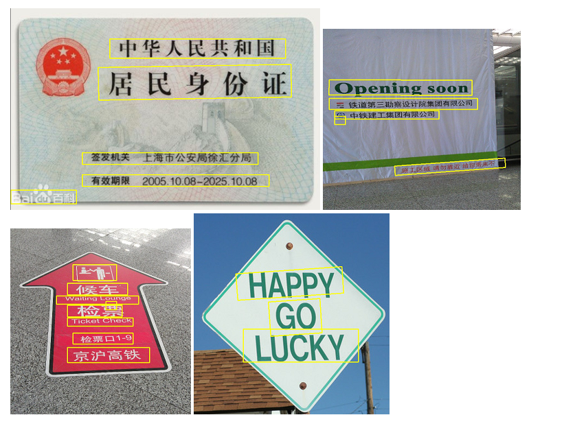

# CTPN_Pytorch

A simple and light-weight implementation of CTPN, a classical text detection network in OCR area. This project is built by Pytorch, 
which greatly simplifies the coding complexity and it makes easier to understand the CTPN inner mechanism.

## Environment
1. ```cd ctpn directory```
2. ```make```

## Train
1. Download this project, and prepare the OCR dataset([MSRA_TD500 & tianchi_icpr](https://pan.baidu.com/s/1kHTI5fg_oTOlQIVjOpFC8A))
2. ```python train.py```，then training will be setup. Before that, you can modify the file ```config```to adjust some parameters.
3. The final training model will be save in ```model```directory.


## Inference
I propose two modes to infer. You can modify the inference mode in file ```test.sh```. We can use command ```sh test.sh```to start text detection. You can download my trained model [here](https://pan.baidu.com/s/17rS1U0045WPHJotQNx7ncw).
1. "python infer.py random cpu" means taht we will inference a batch of pictures in a specific directory path offered in file ```infer.py```. 
2. "python infer.py your_pic_path cpu" means that we will only infer one picture according to your picture path by using cpu.

## Quick test through Docker

I also provide a docker image to help you run this project quickly. If you have installed docker environment, you can download my image through aliyun ```docker pull registry.cn-hangzhou.aliyuncs.com/lijunshi2018/lets_ocr:v1```

Then enter the container and run the project by using cpu.
```
docker run -it -v /home/ljs/lets_OCR:/lets_ocr registry.cn-hangzhou.aliyuncs.com/lijunshi2018/lets_ocr:v1
cd lets_ocr/detector/ctpn/
sh test.sh
```


# Text detection show of this model




## Reference
1. https://github.com/eragonruan/text-detection-ctpn
2. https://github.com/zwenwang/CTPN_Pytorch


## More details
Pls visit my blog to get more details:https://www.cnblogs.com/skyfsm/p/10054386.html
