# Pytorch_CRNN

基于深度学习的端到端文字识别

## 环境

***Pytorch 0.40 + Python3.5 + warp-ctc***

CTC安装：

```
git clone https://github.com/SeanNaren/warp-ctc.git
cd warp-ctc
git checkout ac045b6072b9bc3454fb9f9f17674f0d59373789
mkdir build; cd build
cmake ..
make
cd ../pytorch_binding/
python setup.py install
cd ../build
cp libwarpctc.so ../../usr/lib
```

## 数据准备

原始数据下载：
```
链接：https://pan.baidu.com/s/1Ef-USCOP5F5cSfmNQESkNw 
提取码：1giy 
```

合成的数据：

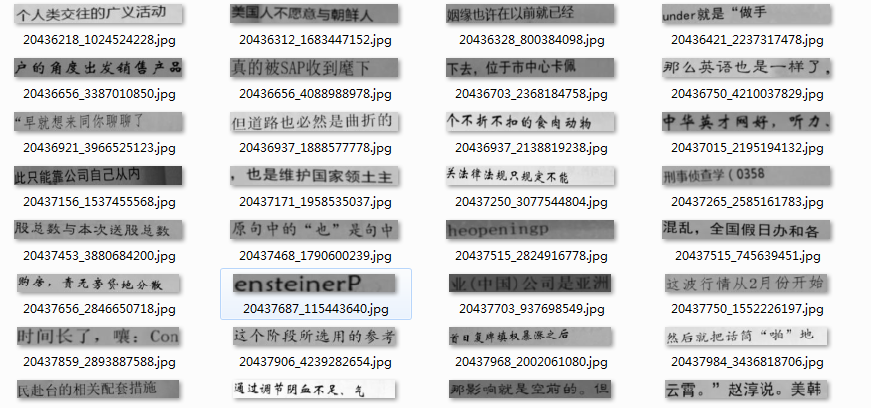

数据标签格式

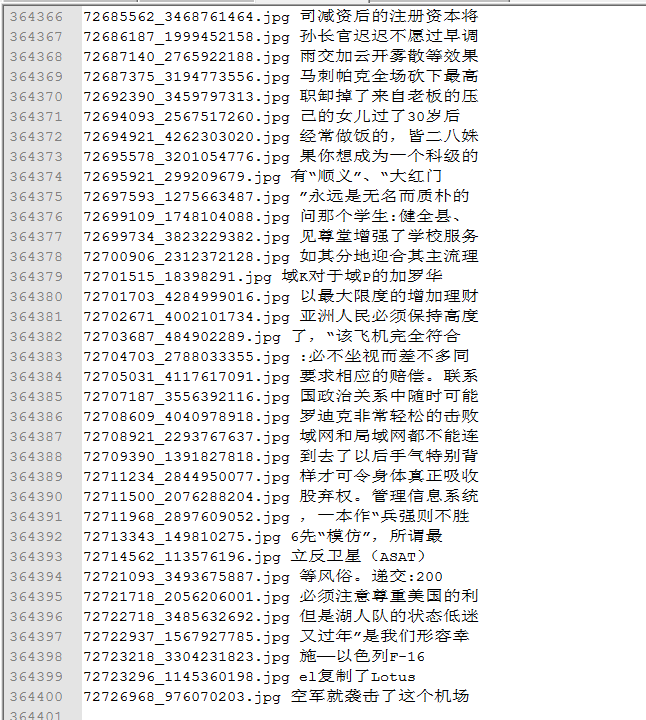

在图像深度学习训练中我们一般都会把原始数据集转化为lmdb格式以方便后续的网络训练，因此我们也需要对该数据集进行lmdb格式转化。我们需要在文件```./lib/create_lmdb_dataset.py```里修改好要转化的数据集的路径，然后执行以下指令。
```
python ./lib/create_lmdb_dataset.py
```

最后会得到两个lmdb文件：test_lmdb和train_lmdb


## CRNN网络结构
整体架构：CNN特征提取，RNN序列信息学习，CTC解码

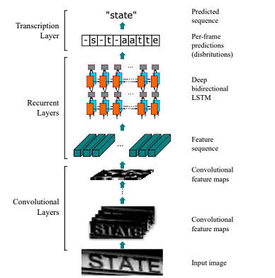

实现的具体网络参数：VGG16+BiLSTM+CTC

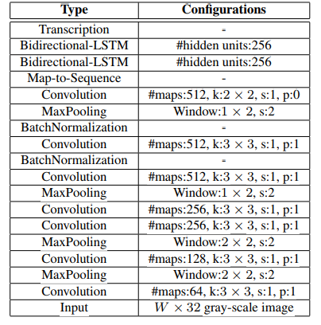

## 训练

我们可以在文件```Config.py```里修改训练时用到的参数，比如训练数据路径、epoch、模型保存路径等参数。

```
python train.py
```
迭代4个epoch后，accuracy达到97.7%。

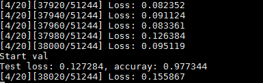

## 测试效果

要使用现有的模型进行推断，可以执行
```
python infer.py 
```

这样程序就会对一个指定目录下的所有图像进行识别，识别路径可以在infer.py里指定。

首先我从测试集中抽取几张图像送入模型识别，识别全部正确。
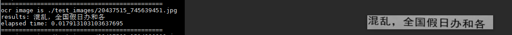

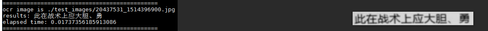

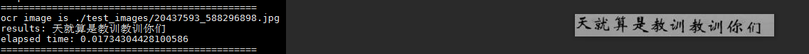

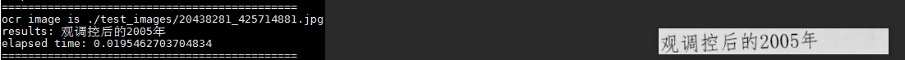

我也随机在一些文档图片、发票扫描图像上截取了一段文字图像送入我们该模型进行识别，识别效果也挺好的，基本识别正确，表明模型泛化能力很强。


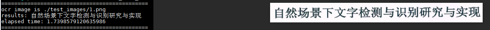

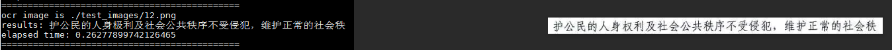

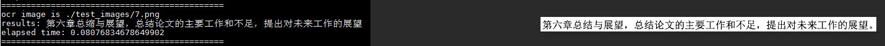

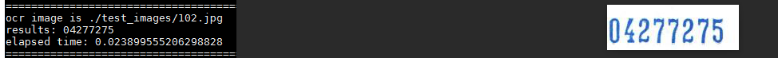

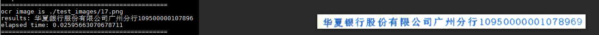

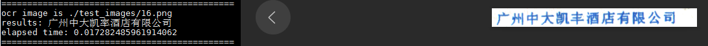


具体实现细节可以参考我的博客：https://www.cnblogs.com/skyfsm/p/10345305.html
